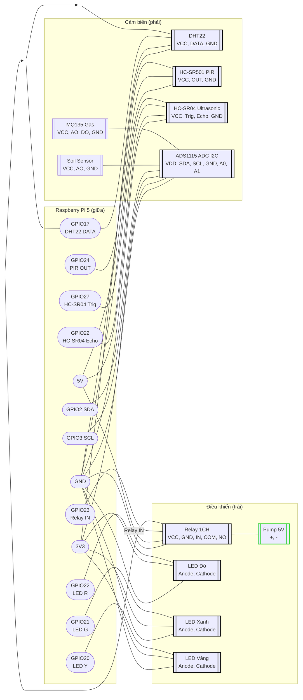
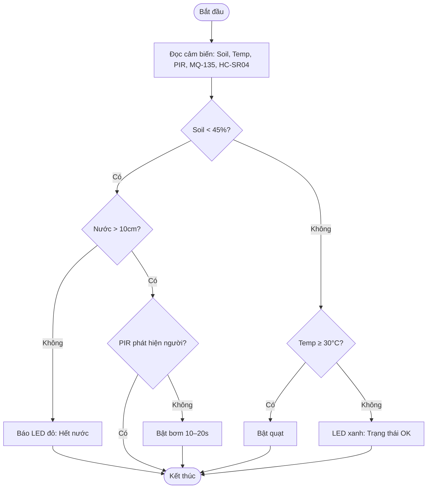

# Sơ đồ nối dây Raspberry Pi 5

```mermaid
flowchart LR
  %% Neo 3 cột
  C0(( )):::ghost --> P0(( )):::ghost --> S0(( )):::ghost
  classDef ghost fill:#ffffff,stroke:#ffffff,stroke-width:0;

  %% ==== CONTROL ====
  subgraph Control["Điều khiển (trái)"]
    direction TB
    Relay[[Relay 1CH<br/>VCC, GND, IN, COM, NO]]
    Pump[[Pump 5V<br/>+, -]]
    LED_R[[LED Đỏ<br/>Anode, Cathode]]
    LED_G[[LED Xanh<br/>Anode, Cathode]]
    LED_Y[[LED Vàng<br/>Anode, Cathode]]
  end
  C0 --- Relay

  %% ==== PI ====
  subgraph Pi["Raspberry Pi 5 (giữa)"]
    direction TB
    GPIO17([GPIO17<br/>DHT22 DATA])
    GPIO23([GPIO23<br/>Relay IN])
    GPIO24([GPIO24<br/>PIR OUT])
    GPIO27([GPIO27<br/>HC-SR04 Trig])
    GPIO22([GPIO22<br/>HC-SR04 Echo])
    SDA2([GPIO2 SDA])
    SCL3([GPIO3 SCL])
    GPIO20([GPIO20<br/>LED Y])
    GPIO21([GPIO21<br/>LED G])
    GPIO22_LED([GPIO22<br/>LED R])
    V3V3([3V3])
    V5V([5V])
    GND1([GND])
  end
  P0 --- GPIO17

  %% ==== SENSOR ====
  subgraph Sensor["Cảm biến (phải)"]
    direction TB
    DHT22[[DHT22<br/>VCC, DATA, GND]]
    MQ135[[MQ135 Gas<br/>VCC, AO, DO, GND]]
    Soil[[Soil Sensor<br/>VCC, AO, GND]]
    PIR[[HC-SR501 PIR<br/>VCC, OUT, GND]]
    HC04[[HC-SR04 Ultrasonic<br/>VCC, Trig, Echo, GND]]
    ADS1115[[ADS1115 ADC I2C<br/>VDD, SDA, SCL, GND, A0, A1]]
  end
  S0 --- DHT22

  %% ==== DÂY CONTROL (mỗi màu) ====
  GPIO23 -- Relay IN --- Relay:::redWire
  V5V --- Relay:::blueWire
  GND1 --- Relay:::blackWire
  Relay --- Pump:::greenWire

  GPIO22_LED --- LED_R:::redWire
  GPIO21 --- LED_G:::greenWire
  GPIO20 --- LED_Y:::yellowWire
  V3V3 --- LED_R:::orangeWire
  V3V3 --- LED_G:::orangeWire
  V3V3 --- LED_Y:::orangeWire
  GND1 --- LED_R:::blackWire
  GND1 --- LED_G:::blackWire
  GND1 --- LED_Y:::blackWire

  %% ==== DÂY SENSOR ====
  GPIO17 --- DHT22:::blueWire
  V3V3 --- DHT22:::orangeWire
  GND1 --- DHT22:::blackWire

  MQ135 --- ADS1115:::purpleWire
  Soil --- ADS1115:::brownWire
  SDA2 --- ADS1115:::cyanWire
  SCL3 --- ADS1115:::pinkWire
  V3V3 --- ADS1115:::orangeWire
  GND1 --- ADS1115:::blackWire

  GPIO24 --- PIR:::blueWire
  V5V --- PIR:::redWire
  GND1 --- PIR:::blackWire

  GPIO27 --- HC04:::blueWire
  GPIO22 --- HC04:::yellowWire
  V5V --- HC04:::redWire
  GND1 --- HC04:::blackWire

  %% ==== Định nghĩa màu ====
  classDef redWire stroke:#ff0000,stroke-width:2px;
  classDef greenWire stroke:#00cc00,stroke-width:2px;
  classDef blueWire stroke:#0066ff,stroke-width:2px;
  classDef yellowWire stroke:#ffcc00,stroke-width:2px;
  classDef orangeWire stroke:#ff6600,stroke-width:2px;
  classDef blackWire stroke:#000000,stroke-width:2px;
  classDef purpleWire stroke:#9900cc,stroke-width:2px;
  classDef brownWire stroke:#8B4513,stroke-width:2px;
  classDef cyanWire stroke:#00cccc,stroke-width:2px;
  classDef pinkWire stroke:#ff66cc,stroke-width:2px;

```

```mermaid
flowchart TD
    S([Bắt đầu]) --> C1[Đọc cảm biến: Soil, Temp, PIR, MQ-135, HC-SR04]
    
    C1 --> D1{Soil < 45%?}
    D1 -- Không --> D2{Temp ≥ 30°C?}
    D1 -- Có --> D3{Nước > 10cm?}
    
    D3 -- Không --> A3[Báo LED đỏ: Hết nước] --> End([Kết thúc])
    D3 -- Có --> D4{PIR phát hiện người?}
    D4 -- Có --> End
    D4 -- Không --> A1[Bật bơm 10–20s] --> End
    
    D2 -- Có --> A2[Bật quạt] --> End
    D2 -- Không --> A4[LED xanh: Trạng thái OK] --> End
```
